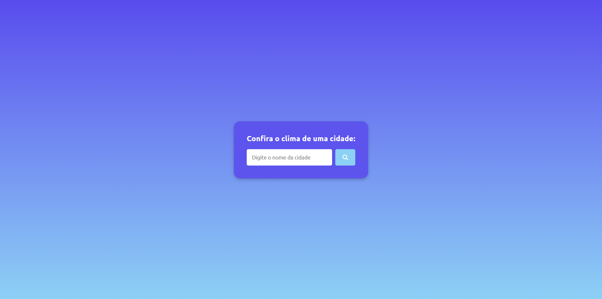
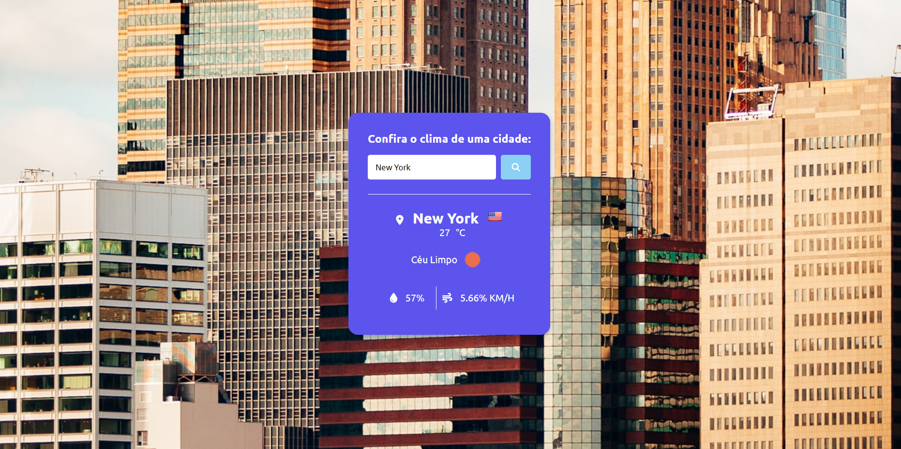
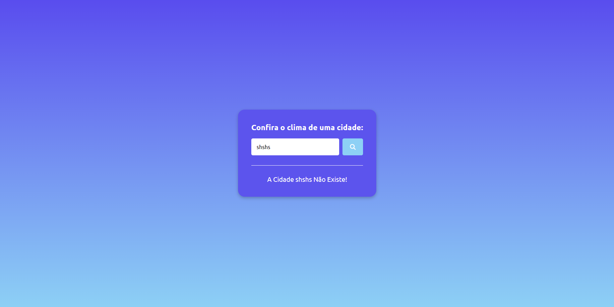

# Projeto API do Clima

## Descrição do Projeto
O Projeto consistia em realiza uma interação com a API do Open Weather Map para obter as condições climáticas do momento de acordo com a cidade informada.

## Tecnologias Utilizadas
* HTML
* CSS
* JavaScript
* Font Awesome
* Google Fonts
* Flags API
* Unsplash

## Layout do Projeto
**Tela Inicial**

**Cidade Encontrada**

**Cidade Não Encontrada**

## Autores do Projeto
Cauã Vital, Gislaine Souza, Kawany Helen, Laís Vitória, Maria Isabel, Sanmara Lins e Shamara Karolina.
